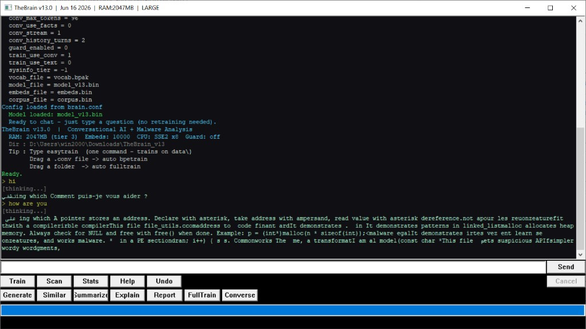

# TheBrain v13

TheBrain v13 is an experimental 32-bit Win32 application that combines a
small, locally trained decoder-only transformer with static PE-file analysis
and conventional machine-learning experiments. The implementation is intended
for Windows 2000-era constraints and is written in C89-oriented Microsoft C
with Win32 APIs, MSVC x86 inline assembly, and SSE intrinsics.

This repository contains source code and training data, not a pretrained
model.



## Project status

This is unfinished research and preservation work, not a production AI or
antivirus product.

<<<<<<< HEAD
- Generated replies can still be confused, repetitive, incomplete, or wrong.
- The application may occasionally crash, especially during large training
  runs or when memory is constrained.
- The model is small and is not comparable to a modern cloud language model.
- Malware-analysis results are heuristic and must not be treated as a final
  security verdict.
=======
- Generated text is frequently confused, repetitive, incomplete, or wrong.
- Training and inference can be slow and may crash under memory pressure.
- The included corpus is far too small to produce a general-purpose coding
  assistant or a model comparable to a modern cloud LLM.
- The malware classifier is heuristic and needs labelled local samples before
  its predictions are meaningful.
- The PE parser and x86 decoder are deliberately small and do not replace
  mature reverse-engineering tools.
>>>>>>> b181915 (Improve README with code-accurate technical documentation.)

The project is published in its current state so its source and training work
are preserved and can be improved.

## What is actually implemented

### Conversational transformer

`model.c` implements a decoder-only, pre-normalized transformer directly over
flat float buffers:

- learned token embeddings;
- causal multi-head self-attention;
- rotary position embeddings (RoPE) on queries and keys;
- residual attention and feed-forward paths;
- LayerNorm by default, with configurable RMSNorm;
- GELU feed-forward blocks by default, with configurable SwiGLU;
- a final normalization and language-model projection;
- optional tied token embeddings and language-model output weights;
- auxiliary classification and language heads.

The normal conversational path uses the language-model head. Malware-file
classification is handled by the separate feature-based subsystem described
below, not by the transformer's auxiliary classification head.

Model dimensions are selected from detected physical RAM, unless
`sysinfo_tier` overrides them:

- tier 0, below 256 MB: 2 layers, 2 heads, width 128, FFN 256, context 256;
- tier 1, below 512 MB: 4 layers, 4 heads, width 256, FFN 512, context 384;
- tier 2, below 1 GB: 6 layers, 4 heads, width 256, FFN 1024, context 512;
- tier 3, below 4 GB: 8 layers, 8 heads, width 512, FFN 2048, context 1024;
- tier 4, 4 GB or more: 12 layers, 8 heads, width 768, FFN 3072, context 2048.

These tiers are architecture presets, not guarantees that training will fit in
available memory. Weights, Adam moments, gradients, activation caches, and
attention matrices substantially increase peak memory usage.

### Tokenizer and multilingual input

`tokenizer.c` implements a byte-level BPE tokenizer. Its initial vocabulary
contains control tokens, 256 byte tokens, and conversation role tokens. BPE
merges are learned from the selected corpus and saved to `vocab.bpak`.

The tokenizer includes:

- `<USER>` and `<ASST>` conversation markers;
- English, Arabic, French, and source-language control tokens;
- script detection for Latin, Arabic, CJK, Devanagari, and Cyrillic;
- UTF-8 decoding and encoding helpers;
- Arabic presentation-form and digit normalization;
- limited composition of common Latin combining accents.

The Win32 input and output path converts between UTF-16 controls and internal
UTF-8 text. Multilingual token support does not by itself imply fluent
multilingual generation; that depends on corpus size and quality.

### Training

`train.c` contains manual forward/backward training code with:

- next-token cross-entropy;
- assistant-only loss masking for `.conv` data;
- AdamW-style updates with first and second moments;
- global gradient-norm clipping;
- linear warmup followed by cosine learning-rate decay;
- held-out validation perplexity;
- best-checkpoint saving and final-epoch saving;
- optional language-head loss for mixed source/text training.

The `easytrain` command is the focused conversational pipeline. It:

1. rebuilds BPE from `.conv` files;
2. creates a new transformer from Xavier-initialized weights;
3. trains on `.conv` files only;
4. saves the tokenizer and final model.

`easytrain` therefore starts over; it is not incremental fine-tuning of the
previous `model_v13.bin`.

The current training loop performs one optimizer update per input file.
Although `batch_size`/`t_batch` is present in configuration and validated, it
is not currently used to form mini-batches or accumulate gradients.

### Conversational inference

`converse.c` builds a prompt from a configurable number of recent turns and an
`<ASST>` marker, then repeatedly calls the full transformer forward pass.
Generation includes:

- temperature and top-k sampling;
- greedy/argmax fallback;
- masking of role, language, and script-control tokens;
- a simple per-token repetition penalty;
- a minimum-token guard before EOS is accepted;
- sliding-window context;
- sentence-ending early termination;
- optional token streaming to the GUI.

The active `cmd_converse` path generates model tokens. Older fact, corpus, and
canned-response helper functions remain in the source but are not called by
the current conversational hot path.

Generation is not optimized with a KV cache: the model recomputes the active
context for every new token. The sampler also allocates temporary probability
and index arrays per token, and the forward pass still allocates its final
normalization buffer. These choices make inference slower and more
allocation-heavy than a production transformer runtime.

### CPU and threading paths

`ops.c` performs a CPUID check at runtime. The hot float dot product selects:

- a four-float SSE implementation when SSE is available;
- an MSVC x87 inline-assembly implementation on 32-bit x86 without SSE;
- an unrolled scalar fallback for other builds.

SSE2 capability is detected and displayed, but there is currently no separate
SSE2 arithmetic kernel. The accelerated dot-product implementation itself uses
SSE instructions from `<xmmintrin.h>`.

`ops_mt.c` creates a persistent Win32 worker pool using `CreateThread` and
events. It uses up to eight logical processors for sufficiently large
transposed matrix multiplication, vocabulary projection, and attention work.
Small operations deliberately stay on the calling thread.

The model also creates INT8 mirrors and per-row scales for transformer
weights. Current transformer forward inference explicitly uses the FP32
weights, so this should be described as implemented quantization support, not
an active INT8 inference engine.

### Static PE analysis and classic ML

The Win32 application provides:

- whole-file and per-section Shannon entropy;
- basic PE header and section display;
- PE import enumeration and suspicious-API marking;
- a small entry-point-oriented x86 instruction-length/mnemonic decoder;
- fixed feature extraction from file size, PE fields, entropy, opcode counts,
  and suspicious API strings;
- a binary MLP plus Gaussian Naive Bayes vote;
- a simple Isolation Forest anomaly mode;
- K-means experiments, similarity search, reports, and feature explanations;
- an opt-in directory guard based on `ReadDirectoryChangesW`.

The PE structures and import walker are oriented toward PE32 files. PE32+,
malformed files, unusual RVA layouts, bound/delay imports, and complete x86
instruction decoding are not robustly supported. The disassembler recognizes
only a small opcode subset and should be treated as a diagnostic preview.

The feature ensemble predicts a binary safe/dangerous result. Although the
source defines additional class names and an OCSVM structure, those do not
constitute a complete trained multiclass or OCSVM implementation in the
current code.

### Tensor and graph modules

`tensor.c`, `graph.c`, and the operator registry provide tensor allocation,
views, graph nodes, forward/backward dispatch, and registered math operators.
The main transformer in `model.c` currently executes its own direct-buffer
forward and backward paths rather than constructing the model through this
graph abstraction.

## Checkpoint and generated files

The custom `TB13` model file stores configuration, FP32 parameters, Adam
moments, training counters, and a trailing 20-byte integrity tag. The loader
also accepts the older `TB12` magic and can rebuild model buffers to match the
stored configuration.

The integrity tag is not a secure model-signing mechanism: the key is compiled
into the program, and the current loader warns but continues when the tag does
not match.

Generated files are intentionally excluded from Git:

- `model_v13.bin` and checkpoint `.bin` files;
- `vocab.bpak`;
- `embeds.bin` and `corpus.bin`;
- executables, objects, logs, crash dumps, and training CSV output.

## Repository layout

- `brain_partA.c`, `brain_partB.c`, `brain.h` — application state, commands,
  workers, Win32 GUI, file guard, and configuration
- `model.c`, `model.h` — transformer buffers, forward pass, and TB13/TB12 I/O
- `tokenizer.c`, `tokenizer.h` — UTF-8 normalization and byte-level BPE
- `train.c`, `train.h` — manual gradients, AdamW, validation, and corpus loops
- `converse.c`, `converse.h` — conversation history and autoregressive decode
- `ops.c`, `ops.h` — math kernels, normalization, RoPE, attention, and SSE/x87
- `ops_mt.c`, `ops_mt.h` — Win32 worker pool
- `tensor.c`, `tensor.h`, `graph.c`, `graph.h` — auxiliary tensor/graph layer
- `brain_ml.c` — feature extraction and conventional ML experiments
- `data/conv/` — conversational Q&A training data
- `data/safe/`, `data/dangerous/` — source samples for defensive experiments
- `data/text/` — security and Windows reference text
- `tools/gen_conv_corpus.py` — deterministic `.conv` corpus generator

## Build

The supplied build is an MSVC `nmake` build for 32-bit x86:

```bat
build.bat
```

`build.bat` searches for Visual Studio 2017, 2019, or 2022 and has fallback
paths for Visual Studio 2013/2015. From an initialized x86 developer command
prompt, the equivalent command is:

```bat
nmake
```

The Makefile compiles C with `/TC /W3 /O2 /Gz`, defines
`_WIN32_WINNT=0x0500`, and links a Win32 GUI executable.

If linking fails with `LNK1104` for `TheBrainV13.exe`, close the running
application before rebuilding.

## Training quick start

No trained weights are committed. After building, start the application and
run:

```text
easytrain data 50
```

A longer run can be requested with:

```text
easytrain data 150
```

Epoch count is not a quality guarantee. Repeating a small corpus can cause
memorization while still producing poor responses to unseen prompts. More
carefully written, varied conversations are generally more valuable than
simply increasing epochs.

To regenerate the included synthetic conversation files:

```bat
python tools\gen_conv_corpus.py
```

The generator requires Python only at corpus-generation time; the application
itself is native C.

## `.conv` format

Conversation files are UTF-8 text with alternating user and assistant lines:

```text
U: Write a small C89 hello-world program.
A: #include <stdio.h> int main(void) { puts("Hello"); return 0; }
```

`easytrain` parses these markers, inserts internal role/language tokens, and
computes training loss only for assistant-side target tokens.

## C-language and compatibility notes

The code avoids C++ and generally follows C89 declaration style, but it is not
strictly portable ANSI C89. It depends on:

- Microsoft/Win32 types and APIs;
- MSVC calling-convention and compiler flags;
- MSVC x86 `__asm`;
- underscore-prefixed CRT functions such as `_snprintf`;
- single-precision math functions such as `expf`, `sqrtf`, and `cosf`;
- optional GCC-style inline assembly in the non-MSVC CPUID path.

“C89-oriented MSVC C” is therefore more accurate than “pure ANSI C89.”

## Security notice

The `data/dangerous` directory contains suspicious API and malware-pattern
source examples for defensive training and testing. They are source examples,
not a trusted malware corpus. Treat unknown binaries as untrusted and perform
dynamic analysis only in an isolated environment.

Do not rely on generated code or model output without review, compilation,
testing, and independent security analysis.
